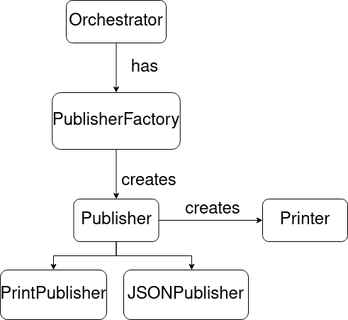
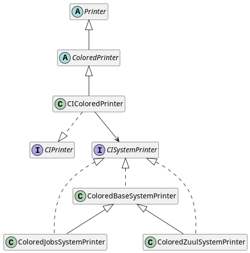
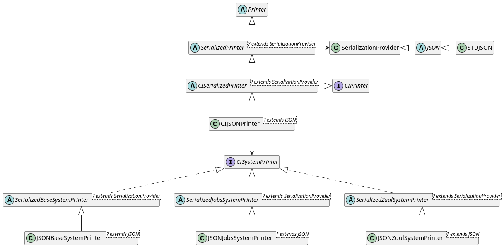
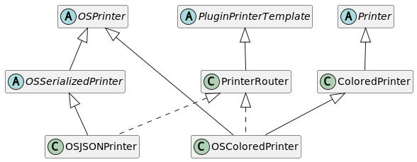

Output
======

To see an overview of cibyl output from a user's perspective see the `output page <../output.html>`_.
From a developer's perspective there are three objects that are involved in
printing the output, which are summarized in the diagram below.

First, the `Orchestrator` processes the query and creates a `Publisher` to handle the output creation.
There are two kinds of publishers: the `PrintPublisher`, which prints
human-readeable text and the `JSONPublisher` that prints JSON output.

The main difference is that the PrintPublisher prints the output for each system after
each environment is queried, while the JSONPublisher prints the output after
all environment are queried. To produce valid json, all the output needs to be
aggregated into a single object, but when printing human-readeable text,
producing output after each environment is queried gives faster feedback to the
user.

To produce the output, the Publisher creates a `Printer` object. Cibyl has
a `Printer` abstract class that is specialized. The used printer
is typically called `CI*Printer`. The `CI` prefix is used because the class
implements the interface defined by the ``CIPrinter`` class. The interface
mandates the implementation of a `print_environment` method. This method
takes an environment object and produces a string representation of its contents.

There are several Printer classes in cibyl, specialized depending on the output
format and the contents. For example, for printing colored output, the
hierarchy shown in the diagram below is established.

The class `CIColoredPrinter` is the Printer that is used for colored text and
it will produce a string representation for all core models. While producing
the output, the printer creates a `CISystemPrinter` object, which is specialized
depending on which kind of system (zuul or jenkins) is being processed. The
system printer is the object that will go through the whole model hierarchy,
starting at the system level, and complete the output string.

As an aside, the `ColoredPrinter` class takes as argument a `Palette` object.
Using a `DefaultPalette` will produce colored output, while using a `ClearText`
palette will produce plain text ( which is the result of passing the flag `-f
text` to cibyl).

For serialized text (json being the main example), there is another set of
classes that provide the funcionality, as shown in the diagram below:

In this case, we have a generic `CISerializedPrinter` that can be specialized
depending on the output format. Currently only a JSON implementation is
available, but through the use of a different `SerializationProvider`, a YAML or XML
implementation could be easily created. For json output, the printer would be
the `CIJSONPrinter`, which would again have some type of `CISystemPrinter`. In
this case it would be either a `JSONBaseSystemPrinter`,
a `JSONJobsSystemPrinter` or a `JSONZuulSystemPrinter`. As can be seen in the
diagram, these three classes are extensions of the
`SerializedBaseSystemPrinter`, `SerializedJobsSystemPrinter` and
`SerializedZuulSystemPrinter`, respectively.

The printers explained above deal with the core models. If the query involved
any funcionality or models provided by a plugin, then the plugin own printer
must be also called. Plugins must create their own printers by inheriting from
the `PluginPrinterTemplate` abstract class. We will ilustrate this relationship
using the openstack plugin as an example:

The openstack plugin introduces a `PrinterRouter` class which implements the
`PluginPrinterTemplate` requirements (an `as_text` and an `as_json` method).
Then, the plugin introduces two printers: `OSJSONPrinter` and `OSColoredPrinter`
for json and human-readeable output. When producing the output, the system
printers explained above will call the `as_text` or `as_json` method from the
appropiate openstack printer and will get the correct string representation for
the plugin-specific models found in the query.
