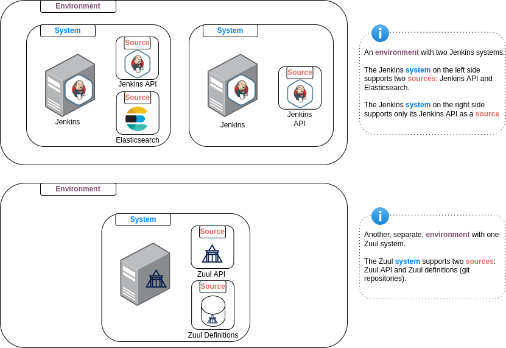

..  documentation master file

=====
Cibyl
=====

Cibyl is a command-line interface and REST API for querying CI environments and systems.

It supports out-of-the-box the following CI systems:

  * Jenkins
  * Zuul

Cibyl allows you to configure multiple environments, where each environment contains one or more CI/CD system and each CI/CD system can be queried using different types of source

The project originated from Red Hat OpenStack DevOps team that looked for a solution to provide a powerful and flexible way for inspecting multiple different CI environments and systems, with regards to product aspects.

The name Cibyl, a form of Sybil, derived from the Greek sybilla or sibilla. Like a prophetess, Cibyl delves into the depths of CI systems
for "hidden" info revelation. CI-byl is also a wordplay that reflects the relation to CI.

Index
=====

.. toctree::
   :maxdepth: 2
   :caption: Quickstart

   bootstrap
   usage

.. toctree::
   :maxdepth: 2
   :caption: Setup

   installation
   configuration

.. toctree::
   :maxdepth: 2
   :caption: Usage

   usage/cli
   usage/api

.. toctree::
   :maxdepth: 2
   :caption: Core

   parser
   plugins
   sources
   output

.. toctree::
   :maxdepth: 2
   :caption: Sources

   sources/jenkins
   sources/zuul_api
   sources/jenkins-job-builder
   sources/elasticsearch
   sources/zuul.d

.. toctree::
   :maxdepth: 2
   :caption: Models

   models/core
   models/plugin

.. toctree::
   :maxdepth: 2
   :caption: Plugins

   plugins/openstack

.. toctree::
   :maxdepth: 2
   :caption: Features

   features

.. toctree::
   :maxdepth: 2
   :caption: Developers

   development/tests
   development/sources
   development/features
   development/output
   development/contribute

Indices and tables
==================

* :ref:`genindex`
* :ref:`modindex`
* :ref:`search`
