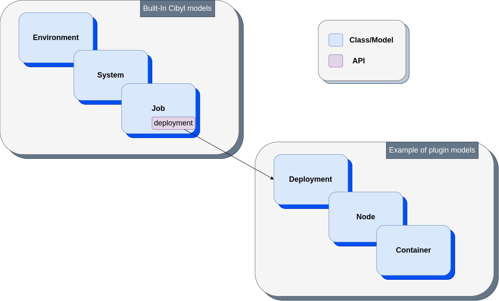

Plugins
=======

Plugins allow you to extend built-in models with your own models. This can be useful in case you would like to associate product related data with your CI models for example, as can be seen in the image below. In this case, the Job model is being associated with the Deployment model through the deployment key in Job's API.

A supported plugin in Cibyl has to adhere following
structure::

    cibyl
    ├── plugins
    │   └── example           # Arbitrary plugin name
    │       └── __init__.py   # Should include Plugin class with _extend method

Plugin Class
^^^^^^^^^^^^

.. code-block:: python

    class ExamplePlugin:

        def _extend(self, model_api: dict):
            model_api['new_attribute'] = {
                'attr_type': str,
                arguments: []
            }
